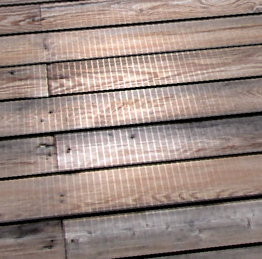

May 26th 2025 @ 14:16 EST 

After struggling for days over build systems and IDE I finally have what I feel is a strong build system. It stook a lot of work and headache but I finally have a CMake system to carry we through the rest of the course.

Transferring over from Visual Studio to VSCode has been difficult but ultimately so worth it. I learned a ton about CMake and how actually it is quite easy to use. The problems in Visual Studio, in particular its lack of ability to have multiple programs in a single project folder, the hidden main.cpp, all the different settings that have to be tuned and set set became such a pain in the ass that it was ultimately worth it to navigate over to the code editor I am more happy with. 

The good news was that a lot of the ground work had been laid to actually catch me up. I didn't have to manufacture a lot of new code - just porting the build system and porting the stages of the Learn OpenGL tutorials over.

I reused the bones of the Triforce LearnOpenGL to make an interpolated rainbow triangle. I did a similar assignment in my Computer Graphics course but obviously with a lot less complexity (for now). This is only a single triangle, the cube had 6 * 2 = 12 triangles and rotated. 

I ported the triangle assignment to make a new rainbow triangle and then used the trifoce vertices to add more colors. A normal triangle has 3 points, the triforce has 6 - meaning double the colors. 

I still need to get a handle on debugging basically every stage of the graphics pipeline. If I am not learning anything in this process it is debugging. I still don't have a super solid grasp on the connection between VAO, VBO, and EBO. Maybe a YouTube video will clear it up? What is next I don't know. I guess I will go back to Learn OpenGL and do the next stage. I could also download a book and give it a read. More to follow tomorrow and the next day. 

Ultimately I would be extremely happy with some kind of solar system simulator and a click and turn feature and a sliding bar to speed or slow down time. 

The dream of a 3D Water Polo video game side project is still very much alive. We will see. 

---------------------------

May 27th 2025

Just managed to import the STB and GLM libraries. The plan of attack for today and tomorrow is to basically catch up to where I was before in the graphics programming class. Lets get a rainbow 3D outputted and rotating and then a 3D cube with a texture mapped to the surface of the cube. That is two separate projects and hopefully it goes smoothly.

After some headaches and a few hours of debugging I have the cube textured with a rainbow interpolation and rotating. A major source of problems was crashing caused by calling the Rendering State Configuration Functions BEFORE the window was properly setup. That is a big note for debugging later. I couldn't even get output on it just immediate crash. IE (glEnable(CL_DEPTH_TEST) / glFrontFace(GL_CCW) / glEnable(GL_CULL_FACE)). Long story short, the window object needs to be properly built before any of those functions can be called.

Drawing the cube on paper was yet again the way to go. Knowing the vertices coordinates and the indices made connecting them so much easier. 

The using of the GLM lib to create the mat4 objects and linking them to the shaders may take some more practice. I understand fundamentally what is happening and why, but the practical application and debugging is still a challenge. I don't know if that is because I am dense or too dim to see it though. Again, I understand the fundamental connection between the shader program and the C++ execution, but just practically learning them has been a challenge. 

I am excited to do more with shaders and with some interactability in the future. My immediate thought is that I can spin the cube with a mouse interaction and use a derivative to slow it down to create an incredibly basic physics simulations. 

I haven't used the STB library yet to import a texture, but that is next on the agenda: finding a square texture somewhere and applying it to the face of the cube. 

------------------------

May 28th 2025 @ 11:33

The cube is now textured with a wood crate / flooring image from OpenGameArt.org! Like every other step of this process it has been more painful than I had anticipated. I'm still mastering the shading language but I think I got the layout down, just getting the process oriented in my head is a bit challenging:

Your LAYOUTS reserve a space on the GPU to allow for skips. IE I have 12 * 6 = 72 vertices and 4 * 6 = 24 texture coordinates. Those need to reserve the breadth across the GPU memory. As in the GPU memory need to be 72 + 24 GLuint floats across. The layouts allow us to split that segment into two different sections for the GPU to work with. This keeps the vertex data separate from the fragment / color data IN THE SHADING LANGUAGE. 

The vertex shader takes INPUTS from the program (our vertices and texture coordinates) and OUTPUTS them (textureCoords). Any outputs need to go to the FRAGMENT shader (BIG NOTE HERE: FOR THE SECOND TIME I HAVE SPENT 30 MINUTES DEBUGGING WHAT WAS A BASIC NAME MISMATCH. THE TWO INPUT AND OUTPUT VARIABLE NAMES MUST MATCH). 

We declare an OUTPUT vec4 FragColor (vec 4 for RBGA and output to output to the screen.) We declare textureCoords as INPUT from the vertex shader. We also declare a uniform sampler2D. Our main rendering loop then has a glUniform1i function to point to the fragment shader program texture unit. 

I'd like to consolidate some of this texture code into its own class or function so that is on the agenda and then modifying the CMake file to properly point to the assets folder. After about 10 minutes I coulnd't get it to work and had to move on to properly debugging the code before I could confirm that any kind of build system change would work. Leaning on one debug output for that kind of thing seems incredibly risky.

Up next is consolidating a lot of the texture work to and properly modify the CMake to get the asset directory structure agnostically.

@ 17:20 

It is all wrapped up. I have a much better understanding of the shading language and the code is a lot cleaner. Maybe an entire class wrapper isn't the way to go there, but it seems like the standard. Hopefully I develop opinions of how it should look later. That would mean I am confident enough to have some expertise. 

Big details to hit for the afternoon session - making sure to Bind the texture unit. That was a small source of begugging at the end there. AND only using the:
#define STB_IMAGE_IMPLEMENTATION
once in a project and then including stb as normal from then on. 

Overall, much more painful than anticipated, but that is typically the only way to learn. Notably, the size of the project is getting more and more unwieldy so when I reach out to the LLM it gives less concise feedback and I have to rely on my programming knowledge more.

I'd still like to rotate it with a mouse and then have it slowly slow down as if it were some kind of character customization screen where the model can be manipulated. I think that might be a good exercise in basic physics simulation.

------------------------

May 30th 2025 @ 15:39

I have the camera class mostly working as intended. I still need to program the mouse buttons for looking around the sceen and that looks a little bit more complicated, but its only a few more lines in the INPUT functions so it shouldn't be too difficult. Building the class wrapper for the camera was fairly simple. We have done this with the Shaders and with the VAO and with textures already. Move all the functions that are normally associated with the camera in main into a class to clean up the main function and reuse the camera later. 

Some noteworthy things I learned so far:
Since we are changing the model matrices to a camera it is only appropriate we stop the model from rotating. This makes practical sense. The model floats in space and we want to move the camera around it, it doesn't necessarily need to be rotating, in fact its more of a distraction than anything. So in the making of the camera I realize I wanted to RE-ADD the rotation to the model matrix for the sake of exercise. I thought it would be difficult but it turned out to be easier than I thought. Our new camera class took the Orientation and Position matrices and passed those to the shader in a uniform mat4 camMatrix. We multiplied them in the class so we only need one matrix in the vertex shader. In general I'd rather have the C++ code be more complicated and let the shaders be simpler so this works out. But it didn't leave an entry point to re-add the model matrix. We can simply define our own, pass it to the shader language with a uniform just like before, and multiply it with the camMatrix variable. Boom done. 
uniform mat4 mModel;
uniform mat4 camMatrix;

IN THE VERTEX SHADER
uniform mat4 mModel;
uniform mat4 camMatrix;

void main() {
	
	gl_Position = camMatrix * mModel * vec4(aPos, 1.0);
	// gl_Position = vec4(aPos, 1.0);
	
	textureCoords = aTexCoord;
}

IN THE MAIN RENDERING LOOP
glm::mat4 model = glm::rotate(glm::mat4(1.0f),
                    rotation,
                    glm::vec3(0.5f, 1.0f, 0.25f)

);

// Get the mModel location
GLuint modelLocation = glGetUniformLocation(shader.getProgramID(), "mModel");
// Pass that location back to the vertex shader
glUniformMatrix4fv(modelLocation, 1, GL_FALSE, glm::value_ptr(model));

Boom. Done and dusted. I learned something new about shaders - which has been what I wanted.

Another thing I learned is the transformation matrices. Always keeping the up matrix as a way of orientating the camera. If it knows a single cardinal direction all the movement can be derived. It might be worth making that a const type so it can't be accidentally changed in the future. The normalizatio nfunction makes every vector's length 1, meaning it always moves at a consant rate. 

Also there is a distinction between GL_BUTTON_PRESS and GL_BUTTON_RELEASE - that proved slightly difficult debugging. 

@ 17:17 - Implementing the camera movement

Going back now and deleting the commented out camera stuff from main before we had the camera wrapper.

Mouse buttons implemented and I am honestly quite confused about how it works. But I'll try to walk myself through it. First, standard stuff, if the mouse button is pressed the cursor should be hidden. Almost every program in the world does this.

We declare doubles for the X and Y coordinates of the mouse - we give those memory addresses to the GetCursorPos function. We pass them as memory addresses since they are going to be updated every loop of the rendering loop.

Next we normalize the cursor to the center of the screen. If we it would immediately move to in the inputted click and jump around, as opposed to us being able to smoothly pan around the window.

We calcualte the new orientation and location and write it to a vec3. 

We have a guarding IF STATEMENT to prevent the camera from pitching forward and preventing the camera from flipping upside down. 

We move our Orientation left and right with the calculated inputs.

Lastly, we unhide the cursor and return it to the center of the screen when we release the mouse button so the cursor doesn't fly away. And reset our first click bool

------------------------

June 1st 2025 @ 12:39

I am trying to understand why we are chaning the cameraMatrix in the camera class. I still don't entirely understand entirely. It seems like all we are doing is incorporating the mat4 cameraMatrix variable into the Camera class definition so the matrix now is a member instead of having to modify it in the main function. Unknown. If I get more insight I will talk about it more here. For now I'm just doing my best to understand what is changing even if it is minor change. 

Leaving for a responsibility - need to write the shader program, write the new vertices and indices to VAO, VBO, and EBO objects, and place it into the rendering loop. Probably a scale function as well so we can shrink the light cube - then we can go back to following the tutorial after that for how lighting works. 

------------------------

June 2nd 2025

Back to the problem. From previous entry I need to insantiate and render the object on screen. Here we go. Writing to the vertex and fragment shader is slightly different. Since we are including a model this time and will be shifting it around we will include a model matrix now. The exercise of having removed the model and then re-adding it without it being pre calculated in the C++ program came in handy. My understanding is that we want this light source to be moveable so we can move the light around. If now the model's location is basically stuck in the middle of the scene. 

The cube is now rendering and is white as intended, but I want to be able to scale it and be move it to a different location so it is smaller and above the textured cube.

Okay, so this is lesson seems to be divived into two parts. Getting the cube setup outside the textured cube and then using the shader language to modify the lighting. 

Just spent the last hour refactoring the main rendering loop. My understanding now is more complete. Basically every object in the world has its own shader program and they need to be executed in order. IE Rendering loop for the Cube and then rendering loop for the Lighting Cube. Which is why they now have two different sets of fragment and vertex shaders. They need to draw their own objects. There is definetely a possibility of abstraction here where we have a different shading language for differnt objects.

A big revelation from the tutorial - lighting for now - is just multiplying the colors of the light together. IE if the light is 
(1.0f, 0.0, 0.0) and the object is (1.0f, 0.5f, 0.0f) or orange. If you multiply them together you get red. The object will now receive a red color. This is reminding me of using red light to read map in the Marine Corps during night land nav. Red markings on the map for roads were invisible and you had to be careful how you red the map since red * red == invisible (in comparison to the other map stuff)

Okay I need to stop for the evening but I think I am ready to move on to normals. I should watch another youtube video on how they exactly work. The tutorial I'm following gives it a 30 second explanation and moves on and I am really confused. My VAO object should be setup to input them tomorrow. My indices on the textured cube have to change for some reason too. I anticipate tomorrow being quite difficult. We will see.

------------------------

June 3rd 2025

Picking up where I left off, today will be watching YouTube videos and making sure I understand normals before I move on and start to input them into the cube vertices and debug it. I want to make sure I completely understand this concept and can implement it, at least in overall concept, before I ask an LLM to debug my code. 

What I do understand. The normal vectors for diffuse lightings are just vectors of size one that shoot out perpendicularly from the face of the primitive. This is called a face normal. If each face has a single normal, that normal represents the orientation of the entire flat face, and thusm its effect is unform across the face. IE - there is no interpolation - the smooth spread of the light across the surface won't happen. See the picture at the top of the learnopengl page for the example of the diffuse lighting. The new frag color is calculated and then spread across the entire face of the cube. 

https://learnopengl.com/Lighting/Basic-Lighting

However, in your current code we are setup to provide the veritces with 3 sets of data - 3 floats for the vertex coordinates, 2 floats for the texture coordinates spread across the face of the cube, and 3 more floats for the normal data - the normals allow us to interpolate a new color across the face of the cube. 

How we find the location of these normals is pretty complicated and a class in trig and linear algebra specifically for graphics programming would be incredibly helpful. We calculate the face normal by taking the CROSS PRODUCT (not the dot product) of two NON-PARALLEL edge vectors that form the face. For example, if you hve a triangle wth vertices A, B, and C you can find the normal by: normalize(cross(B - A), C - A)
	 B
    / \
   /    \
  /       \  
 /          \
A-------------C

Vertex normals, what we are using so we can interpolate the fragment shader, are typically pre calculated by the 3D grapics modeling software and are incorporated in the mesh data. It works by averaguing the face ormals of all the polygons connected to that vertex. This average then points outwards in a way that allows for smooth lighting interpolation. 

The dot product is used AFTER you have the normal. It's used in the lighting equation to determine the ANGLE between two vectors. The prime example being the angle between the surface normal and the light direction.

Light source      Normal Vector
	        \   |
	         \  |
     Angle    \	|
______________________________________
               Surface of the mesh

Normally, this kind of normals data will be calculated in 3D modeling software. A piece of software like Blender's most basic application is allowing an artist to design meshes and animate things. Those meshes and transformation are simply vertices / lighting values - like our cube - but far too complex to input by hand. So the work is extrapolated to the 3D art software. For this reason I will have to manually input the normal data. This will likely be difficult and I'll have to find a decent method of calculating it by hand. Lastly the steps I will have to do to finish this lesson are: 
1.| Modify vertices data to take in normal data
2.| Modify the VAO linking function to account for 3 more floats
3.| Change the default vertex shader layout
4.| In the default.vert add a vec3 output for the normal, add a vec3 output fragPos so the 'light' can be interpolated and then take care of the calculations in the fragment shader.

I shouldn't have to modify indices - but we will see. I am slightly different than the tutorial I am following. It seems like I've already taken care of that because I am using a textured cube as opposed to a pyramid.

@ 18:27

Done and working as intended.

The modification of the vertices and the VAO object was quite a bit easier than I thought it would be. I thought the Normal vectors would be different for some reason, but either kind of the normals works for all kinds of lighting is now my understanding. So inputting a perpendicular line was easy. The top face was labeled in the comments (0.0, 1.0, 0.0) is a straight up vector. Easy.

Changing the VAO object was easy as well. Just account for the layout, data, and offsets, and we are good.

The hardest part I need to go back and read the learnopengl article on is the fragment and vertex shader changes I had to make. I somewhat understand the steps, but the math is a complete mystery. Again, I really would love to take a trig, calc, linear algebra class FOR computer graphics. LOTS AND LOTS OF linear algebra above the hood and I'm sure loads of calc and trig below. Just the feeding of the camera position, lighting position is the biggest key here. I don't know what more there is to say besides I'm somewhat glad this is over, but of course, I know its not and I will be returning for the rest of my graphics programming career so I might as well get cozy with the concepts over the week.

------------------------

June 4th 2025

Next up the Specular Maps. Specular maps are a type of texture map to control the amount and color of specular reflections on a surface. My understanding is that it is a basically a black and white (or more specifically - grayscale) version of the texture and that shows how reflective the light should be. So in our wood texture there is a lot of blacks and darker colors at are inbetween the wood 'planks'. That light needs to be relfected LESS than the lighter part of the wood which would reflect more. As it is now - the specular reflections are just uniform across the surface and looks good, but not quite realistic. The specular map will provide an even more realistic gradient. 

For the sake of the tutorial we will begin by modifying the texture class so it is easier for us to assign multiple textures to the same shader. For the sake of seeing the example it may be worth it to use a different image that has more contrast. The wood crate texture I am using now doesn't have very much dark color across it. We can also move the light a bit closer.

We get the specular map into our main.cpp by importing the texture but only using ONE color channel, in this case, red. Because we are only using one color channel this will effectively grayscale the image. We will create a new texture object and work to port it over after commenting out some of the other texture statements. We will then export it to the shader, and bind it in the main rendering loop. That should be the work to be done in main.cpp

Now in the shader, we import the texture in the default.frag and use that to modify the final frag color. More to follow on those details.

A new revelation - the image that is loaded for the specular mapping actually has to be grayscaled. We can't rely on anything to grayscale for us. I would love an stbi function to grayscale it, but oh well. We use the .r for the single channel on the grayscaled image to get the proper specular map. 

It is fairly easy actually. The biggest changes are only in our specular lighting section of the fragment shader. We declare an extra uniform sampler2D for the grayscaled texture. We use ONLY THE RED CHANNEL from that texture to calculate our finalSpecularStrength INSTEAD of only using standard texture. From there we cacluate the lighting as normal. The same calculations are stored in result. Result is then pushed to FragColor as a vec4. FragColor still takes the NON grayscaled texture (we still want to load the colored texture).

The last issue I am facing is the vertical lines of light the are across the surface of the cube. It signals to me that the specular lighting is working better now, but it is a strange artifact to have and there are no answers readily found with google. 

I couldn't find an issue or a solution in an easy amount of time. I will keep it in there for a while until I find something that causes this. I am ready to put this one to bed. 

Laslty, specular lighting is going to be incredibly important in a water polo video game. The way the light reflects off the surface of the water is going to change from pool to pool (indoors, outdoors, kinds of overhead lights, if there are windows etc etc).

Like a LOT of these tutorials, there is obviously huge amounts of potential for abstraction. I am trying to follow a bit of Jonathan Blows advice and wait sometime before refactoring anything. Often times we want to refactor something for the sake of cleanliness and readability or whatever great programming virtue, but we often refactor TOO soon. Meaning, there is still more to learn about a particular technology or product and a more intelligent refactoring is just around the corner and we end up wasting time refactoring code more times than necessary. Build up the expertise and lessons learned AND then refactor. Maybe that will have the lessons stick less - that is a factor I am worried about, but I think he is correct about waiting to apply our lessons learned before we go forward. 

This does also conflict with his advice of, write a program, rewrite it so its better, rewrite it so it is even better again and again until it is perfect. And maybe, if you're lucky you have a good program that does something interesting with the computer. More to follow. 

